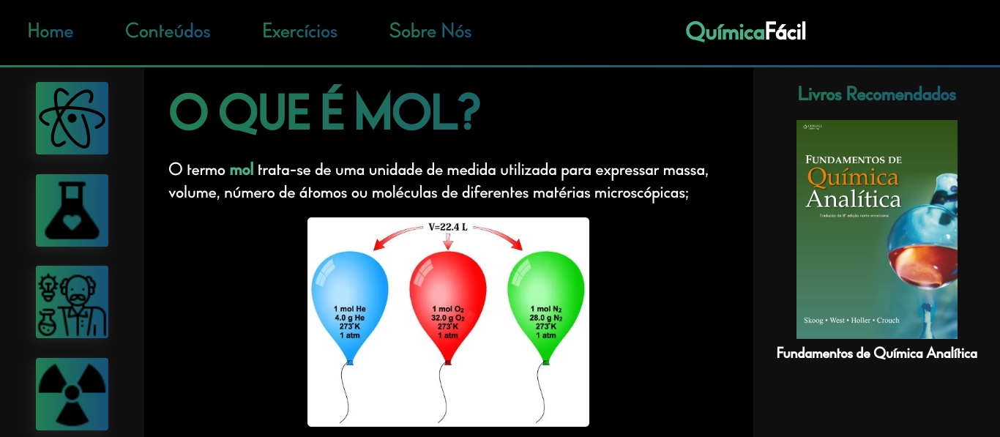

<h1 align="center"> QuímicaFácil </h1>

<h2 align="center">Um site educativo feito com CSS Grid com foco em conteúdos de química</h2>

<h2> ➢ O que é esse projeto? </h2>

 
  Este projeto foi feito com o objetivo de treinar o Grid Layout do CSS3. Trata-se de um site
  escolar focado em conteúdos de química. O site está responsivo e pode ser acessado por
  dispositivos móveis.

 
  Além de treinar o CSS Grid, aproveitei também para explorar um estilo de design mais
  moderno e elegante para a página, algo que não estou muito acostumado a fazer.

  Você pode acessar o site clicando neste link: https://quimicafacil.vercel.app

<h3> ➢ Outras informações </h3>
<ul>
  <li> <strong>Status:</strong> <em>Desenvolvendo</em>
  <li> <strong>Linguagens utilizadas:</strong>  
    

      
      
      
    

  <li> <strong>Conhecimentos aplicados:</strong>
  <ul>
    <li> <em>CSS GRID</em>
    <li> <em>Animações com CSS </em>
    <li> <em>CSS Custom Properties</em>
    <li> <em>Media Queries</em>
    <li> <em>JavaScript DOM</em>
  </ul>
</ul>
